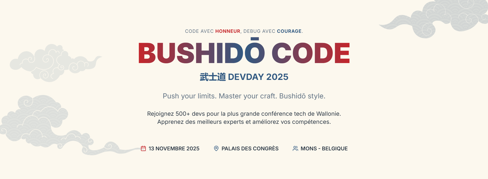

# DevDay 2025 - Speaker Resources Repository

Bienvenue dans le repository des ressources des speakers de **DevDay 2025** ! 

Ce repository est conçu pour héberger tous les matériaux partagés par nos speakers : slides, démos, code samples, et autres ressources éducatives pour les participants.

---

## À propos de DevDay 2025

DevDay est la plus grande conférence technologique en Belgique. L'édition 2025 rassemble les meilleurs speakers et experts pour explorer les tendances technologiques les plus innovantes.

**Dates:** 13 novembre 2025  
**Lieu:** Palais des Congrès de Mons, Belgique  
**Site officiel:** [devday.be](https://devday.be)

---

## 📋 Structure du Repository

```
├── sessions/                    # Dossiers des sessions
│   ├── 01-ia-devs-nouvelle-equation-code/
│   ├── 02-keynote-ia-veille-technologique-etudiants/
│   ├── ...
│   └── 41-pasta-architecture-dotnet/
├── assets/                      # Images et ressources visuelles
├── CODE_OF_CONDUCT.md          # Code de conduite
├── CONTRIBUTING.md             # Guide de contribution
└── README.md                   # Ce fichier
```

---

## 🎯 Sessions

### Keynotes & Plenary Sessions

- **01 - IA + Devs : la nouvelle équation du code** - David Rousset
- **02 - Keynote IA & Veille Technologique pour Étudiants** - Alexandra Zakharova

### AI & Machine Learning

- **03 - Machine Learning comme un rōnin : zéro cloud, 100% contrôle** - Simon Baudart, Paul Rivière
- **19 - AI4Fun** - David Rousset, Mitsuru Furuta
- **20 - Using GenAI on and inside your code, what could possibly go wrong?** - Niels Tanis
- **27 - AI Native Development: From Random Prompting to Systematic Engineering** - Daniel Meppiel
- **30 - Agentic applications in minutes with Azure AI Foundry** - Nicolas van de Walle
- **40 - Défis à l'ère de la data et de l'IA** - Loïc Lejoly

### Cloud & Infrastructure

- **05 - Designing, Building and Optimizing APIs with API Green Score Framework** - Diallo Thierno
- **14 - Intégration de capteurs IoT avec AWS Cloud** - Maximilien Charlier
- **23 - .NET Aspire et architecture micro-service avec YARP** - Gilles Flisch
- **28 - Building a low carbon cloud provider from the ground up** - Luis Akakpo
- **29 - AI Meets Integration: Building Smart Agents in Azure Logic Apps** - Dieter Gobeyn
- **31 - Feature Flag: la fin des mises en prod traditionnelles** - Michel Perfetti
- **33 - Gouverner l'IA avec Honneur : AI Gateway sur Azure** - Nicolas Robert
- **38 - Zero-Code, Full Power: Building Secure Serverless Data APIs with Azure** - Massimo Crippa

### .NET & Web Development

- **07 - FluentUI Blazor: Le combo gagnant pour des applis qui ont du style** - Denis Voituron
- **08 - Plan, Do, Check… Agent ! — Microsoft Agent Framework** - Adrien Clerbois
- **15 - Blazor & .NET 10 – Plus rapide, plus clair, plus fiable** - Christophe Peugnet, Denis Voituron
- **32 - Les strings en .NET : une longue histoire d'amour** - Christophe Nasarre
- **41 - PASTA Architecture: AI Dente Code for Modern .NET** - Danyl Novhorodov

### Frontend & Architecture

- **06 - AI Agents Face-Off: Same App, Multiple Frameworks** - Elaine Dias Batista
- **26 - Le futur d'Angular : Au-delà de ngZone** - Loïc Magnette, Simon Hock

### Data & Databases

- **22 - The art of data retention in PostgreSQL** - Stefan Fercot
- **34 - Data Platforms over time** - Aurélien Allienne
- **36 - Microsoft Fabric : la fin du Data Engineer ?** - Arthur Caron

### DevOps & Developer Tools

- **09 - Construire son propre processeur : du silicium au code** - Sébastien Warin
- **10 - API Alchemy: Transforming Enterprise Endpoints for the AI Agent Revolution** - Peter Eijgermans
- **13 - Comprendre les compilateurs : plus simple qu'il n'y paraît !** - Philippe Vlérick
- **17 - The art of Mona, from building to deploying with Ninjas** - Come Redon
- **25 - Tester c'est douter! (Devenir un maître des Tests avec GitHub Copilot)** - Philippe Didiergeorges, Lucile Jeanneret
- **37 - GitHub Copilot Showdown** - Philippe Didiergeorges, Emmanuelle Hemmer, Adrien Clerbois, Julien Strebler

### Soft Skills & Agility

- **04 - Et toi ? Tu codes comme un samouraï ou comme un ronin ?** - Eric Decossaux
- **11 - Un sprint à Tokyo : voyage Agile au Japon** - Anaïs Moulin
- **12 - Le moral comme KPI** - Bernard Ludovic
- **16 - Failure MUST be an option** - Olivier Breda
- **21 - Optimize your event-driven architectures with Drasi** - Christophe Gigax
- **35 - Low Code, No Pro Code… et pourtant, ça cartonne !** - Jeremy Laplaine
- **39 - Le Lean appliqué à la consommation d'énergie de votre ménage!** - Mathieu Gendaj

### Legal & Ethics

- **18 - IA et biais sexistes : comprendre, mesurer, corriger** - Emmanuelle Hemmer
- **24 - AI Act : l'Europe trace la voie d'une IA de confiance** - Antoine Smet

---

## 📁 Comment soumettre vos ressources

### Pour les speakers

1. **Créez une branche** à partir de `main`:
   ```bash
   git checkout -b add/session-[numero]-[titre-court]
   ```

2. **Accédez au dossier** de votre session:
   ```bash
   cd sessions/[numero]-[titre-session]/
   ```

3. **Ajoutez vos ressources**:
   - `README.md` - Brève description (facultatif)
   - Slides (format PDF, PPTX, ou autre)
   - Code samples/démos
   - Articles, liens, références
   - Toute autre ressource pertinente

4. **Soumettez une Pull Request** avec:
   - Un titre clair : `[Session XX] Add speaker resources for [Session Title]`
   - Une description brève de ce que vous ajoutez
   - Votre nom et affiliation si souhaité

5. **Attendez la validation** par l'équipe d'organisation

### Directives pour les contributions

- **Respectez le Code of Conduct** (voir `CODE_OF_CONDUCT.md`)
- Utilisez des chemins relatifs pour les ressources
- Documentez le contenu si nécessaire
- Formats acceptés : PDF, PPTX, DOCX, MD, ZIP (pour plusieurs fichiers), images (PNG, JPG, SVG)
- Limite de taille par PR : 100 MB maximum
- Pas de contenu publicitaire sans modération
- Respectez les licences de propriété intellectuelle

---

## 🛠️ Structure d'une session

Chaque dossier de session peut contenir:

```
[numero]-[titre-session]/
├── README.md                    # Description de la session
├── SPEAKER.md                   # Infos du/des speakers (optionnel)
├── slides.pdf                   # Slides de la présentation
├── slides.pptx                  # Ou format PowerPoint
├── demo/                        # Dossier des démos
│   ├── code-sample.zip
│   ├── live-demo.html
│   └── README.md
├── resources/                   # Ressources additionnelles
│   ├── articles.md
│   ├── references.txt
│   └── liens-utiles.md
└── notes.md                     # Notes du speaker
```

---

## 📜 License

Tous les contenus publiés dans ce repository restent la propriété de leurs auteurs respectifs. Les speakers conservent les droits d'auteur sur leurs ressources.

Par défaut, les contenus sont publiés sous licence **Creative Commons Attribution 4.0 International (CC BY 4.0)** sauf indication contraire du speaker.

---

## 🤝 Contribution

Vous trouvez une erreur ou vous avez une suggestion ? Consultez `CONTRIBUTING.md` pour savoir comment contribuer!

---

## 📞 Contact & Support

- **Questions d'organisation**: team@devday.be
- **Issues/Bugs du repository**: Ouvrez une [GitHub Issue](https://github.com/DevDayBe/edition-2025/issues)
- **Site officiel**: https://devday.be

---

## 🙏 Remerciements

Un grand merci à tous les speakers, organisateurs et contributeurs qui font de DevDay 2025 un événement exceptionnel !

**Made with ❤️ for the Belgian Developer Community**

---

## 🎉 Remerciements à nos sponsors

Nous tenons à exprimer notre profonde gratitude envers nos sponsors pour leur soutien inestimable à DevDay 2025. Grâce à eux, cet événement est possible !

### 🥇 Sponsors Gold
- [Wavenet](https://www.wavenet.be/)

### 🥈 Sponsors Silver
- [Journée Agile](https://www.journeeagile.be/)
- [Microsoft](https://www.microsoft.com/fr-be)
- [Oniryx](https://www.oniryx.be/)

### 🤝 Partenaires
- [B&B Hotels](https://www.hotel-bb.com/fr/hotel/mons-gare)
- [Birdit](http://www.birdit.be/)
- [DevApps](http://www.devapps.be/)
- [Salon du Livre de Wallonie](https://monslivre.be/salon-du-livre-de-wallonie/)
- [Sense of Tech](https://www.senseof.tech/)
- [Sparkle](http://www.sparkle.tech/)

Pour découvrir tous nos sponsors, visitez notre page dédiée : [devday.be/sponsors](https://devday.be/sponsors)

---